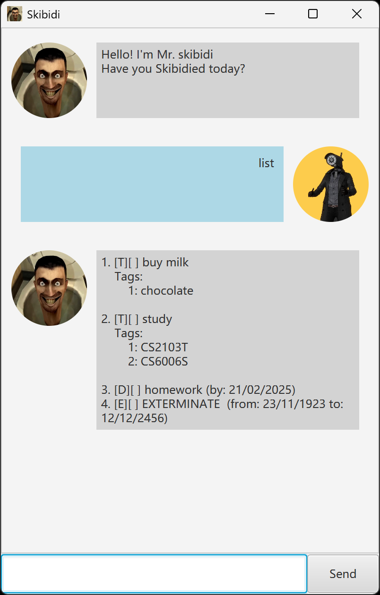

# Skibidi User Guide

   
   

 

SKIBIDI my fellow humans :toilet:. Have You ever wanted to have a personalised task manager chatbot?

Meet Skibidi -- A skibidi toilet :toilet: inspired fun chatbot that fulfills your task managing needs!

## Adding todos

Using `todo [item]` to add an todo item to the item list.

Example: `todo buy milk`

Output:

   
  

## Adding deadlines

Using `dealine [item] /by YYYY-MM-DD` to add a deadline item to the item list.

Example: `deadline dinner /by 2025-12-12`

Output:

   
  

## Adding events

Using `event [item] /from YYYY-MM-DD /to YYYY-MM-DD` to add an event item to the item list.

Example: `event save the earth /from 2000-01-01 /to 2111-11-11`

Output:

   
  

## Listing existing items 

Using `list` to list out all items in item list.

Output:

   
  

## Delete items

Using `delete [item index]` to remove an item from the item list.

Example: `delete 1`

Output:

   
  

## Mark items

Using `mark [item index]` to mark an item to the item list.

Example: `mark 1`

Output:

   
  

## Unmark items

Using `unmark [item index]` to unmark an item to the item list.

Example: `unmark 1`

Output:

   
  

## Adding tags to items

Using `tag [item index] [tag]` to add a tag to an item in the item list.

Example: `tag 1 whole`

Output:

   
  

  
## Removing tags from items

Using `untag [item index] [tag index]` to add a tag to an item in the item list.

Example: `untag 1 1`

Output:

   
  

